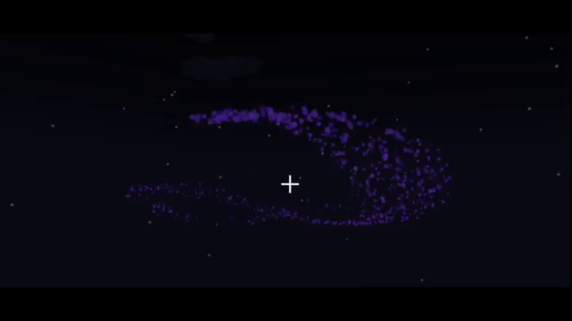

<!-- PROJECT SHIELDS -->
<!--
*** I'm using markdown "reference style" links for readability.
*** Reference links are enclosed in brackets [ ] instead of parentheses ( ).
*** See the bottom of this document for the declaration of the reference variables
*** for contributors-url, forks-url, etc. This is an optional, concise syntax you may use.
*** https://www.markdownguide.org/basic-syntax/#reference-style-links
-->
[![Contributors][contributors-shield]][contributors-url]
[![Forks][forks-shield]][forks-url]
[![Stargazers][stars-shield]][stars-url]
[![Issues][issues-shield]][issues-url]
[![APACHE-2.0 License][license-shield]][license-url]

<!-- PROJECT LOGO -->
 

  

<h3 align="center">ParticleEmitter</h3>

  

    <a href="https://github.com/WorldSeedGames/ParticleEmitter/issues">Report Bug</a>
    ·
    <a href="https://github.com/WorldSeedGames/ParticleEmitter/issues">Request Feature</a>
  

<!-- ABOUT THE PROJECT -->
## About The Project

  
  

This is a library that allows users use blockbench particle files in **Vanilla Minecraft**!

With this library, you can design particle animations with [snowstorm](https://snowstorm.app/) and draw them in a Minecraft world.

Currently only [Minestom](https://github.com/Minestom/Minestom) is supported.

<!-- GETTING STARTED -->
## Getting Started

A full, runnable example server can be found in [here](https://github.com/WorldSeedGames/ParticleEmitter/tree/master/src/test/java)

Particle examples can be found [here](https://github.com/WorldSeedGames/ParticleEmitter/tree/master/src/test/resources/particles)

## Features

ParticleEmitter supports the following features
- Emitter lifetime expression, loop and once
- Emitter rate instant and steady
- Emitter shape box, disc, point and sphere
- Particle tinting (colour)

## Limitations

Minecraft Query Language (MQL) does not fully support Molang
- Variables do not work
- Functions do not work

Particle Restrictions
- Velocity and acceleration don't work
- Custom particle textures don't work
- Curves have not been implemented
- Particle lifetimes have not been implemented

(<a href="#top">back to top</a>)

<!-- MARKDOWN LINKS & IMAGES -->
<!-- https://www.markdownguide.org/basic-syntax/#reference-style-links -->
[contributors-shield]: https://img.shields.io/github/contributors/WorldSeedGames/ParticleEmitter.svg?style=for-the-badge
[contributors-url]: https://github.com/WorldSeedGames/ParticleEmitter/graphs/contributors
[forks-shield]: https://img.shields.io/github/forks/WorldSeedGames/ParticleEmitter.svg?style=for-the-badge
[forks-url]: https://github.com/othneildrew/Best-README-Template/network/members
[stars-shield]: https://img.shields.io/github/stars/WorldSeedGames/ParticleEmitter.svg?style=for-the-badge
[stars-url]: https://github.com/WorldSeedGames/ParticleEmitter/stargazers
[issues-shield]: https://img.shields.io/github/issues/WorldSeedGames/ParticleEmitter.svg?style=for-the-badge
[issues-url]: https://github.com/WorldSeedGames/ParticleEmitter/issues
[license-shield]: https://img.shields.io/github/license/WorldSeedGames/ParticleEmitter?style=for-the-badge
[license-url]: https://github.com/WorldSeedGames/ParticleEmitter/blob/master/LICENSE
