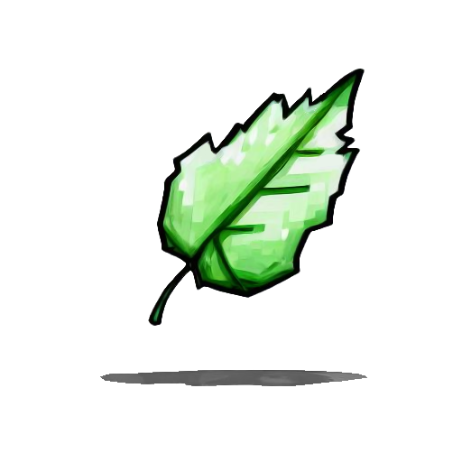

<div id="top"></div>

<!-- PROJECT SHIELDS -->
<!--
*** I'm using markdown "reference style" links for readability.
*** Reference links are enclosed in brackets [ ] instead of parentheses ( ).
*** See the bottom of this document for the declaration of the reference variables
*** for contributors-url, forks-url, etc. This is an optional, concise syntax you may use.
*** https://www.markdownguide.org/basic-syntax/#reference-style-links
-->
[![Contributors][contributors-shield]][contributors-url]
[![Forks][forks-shield]][forks-url]
[![Stargazers][stars-shield]][stars-url]
[![Issues][issues-shield]][issues-url]
[![APACHE-2.0 License][license-shield]][license-url]

<!-- PROJECT LOGO -->
<br />
<div align="center">
  <a href="https://github.com/WorldSeedGames/ParticleEmitter">
    
  </a>

<h3 align="center">ParticleEmitter</h3>
  <p align="center">
    <a href="https://github.com/WorldSeedGames/ParticleEmitter/issues">Report Bug</a>
    ·
    <a href="https://github.com/WorldSeedGames/ParticleEmitter/issues">Request Feature</a>
  </p>
</div>

<!-- ABOUT THE PROJECT -->
## About The Project
<div align="center">
  <a href="https://github.com/WorldSeedGames/ParticleEmitter">
    
  </a>
  </div>

With this library, you can design particle animations with [snowstorm](https://snowstorm.app/) and draw them in a Minecraft world.

Currently only [Minestom](https://github.com/Minestom/Minestom) is supported.

<!-- GETTING STARTED -->
## Getting Started

A full, runnable example server can be found in [here](https://github.com/WorldSeedGames/ParticleEmitter/blob/master/src/test/java/Demo.java)

Particle examples can be found [here](https://github.com/WorldSeedGames/ParticleEmitter/tree/master/src/test/resources/particles)

### Adding as a dependency

Add the following to your `build.gradle.kts` file:

```
repositories {
    maven("https://reposilite.worldseed.online/public")
}
```

Add the library as a dependency
```
dependencies {
    implementation("net.worldseed.particleemitter:ParticleEmitter:<version>")
}
```

The lastest version number can be found [here](https://reposilite.worldseed.online/#/public/net/worldseed/particleemitter/ParticleEmitter)

### JAVA FLAGS

To execute the code you must add the java VM flag `--add-opens java.base/java.lang=ALL-UNNAMED`.

## Features

ParticleEmitter supports the following features
- Emitter lifetime expression, loop and once
- Emitter rate instant and steady
- Emitter shape box, disc, point and sphere
- Particle tinting (colour)

## Limitations

[Minecraft Query Language](https://github.com/hollow-cube/common/tree/main/modules/mql) (MQL) does not fully support Molang
- Variables do not work
- Functions do not work

Particle Restrictions
- Velocity only works on certain particles and acceleration don't work on any particles
- Custom particle textures don't work
- Curves have not been implemented
- Particle lifetimes have not been implemented

## Usage notes

### Particle amounts
You may notice in practice that only one particle gets spawned per `emitter.tick()`. 
In some cases, this may be a problem as you may want to have more control over the amount of particles spawned for the same animation as demonstrated in the following video where the same animation is being played in 4 different positions with differing particle amounts:
https://github.com/user-attachments/assets/8fd4f277-eb8d-4a3e-b068-18533f72346a

This can be achieved by using a for loop around the `emitter.tick()` like so:
```java
Collection<ParticlePacket> packets = new ArrayList<>();
for (int i = 0; i < amount; i++) {
    packets.addAll(emitter.tick());
}
if (emitter.status() != EmitterLifetime.LifetimeState.DEAD) {
    packets.forEach(packet -> {
        instance.getPlayers().forEach(p -> p.sendPackets(packet));
    });
}
```
However, this method will require each emitter to have a different `updatesPerSecond` parameter equal to `x*amount` for the animations to be synchronised and play at the same time with differing particle counts, otherwise the animation may speed up or slow down.
```java
List<ParticleEmitter> emitters = new ArrayList<>();
{
    var emitter = ParticleParser.parse(Particle.DUST_COLOR_TRANSITION, 1000*amount, map);
    emitters.add(emitter);
}
```


<p align="right">(<a href="#top">back to top</a>)</p>

<!-- MARKDOWN LINKS & IMAGES -->
<!-- https://www.markdownguide.org/basic-syntax/#reference-style-links -->
[contributors-shield]: https://img.shields.io/github/contributors/WorldSeedGames/ParticleEmitter.svg?style=for-the-badge
[contributors-url]: https://github.com/WorldSeedGames/ParticleEmitter/graphs/contributors
[forks-shield]: https://img.shields.io/github/forks/WorldSeedGames/ParticleEmitter.svg?style=for-the-badge
[forks-url]: https://github.com/othneildrew/Best-README-Template/network/members
[stars-shield]: https://img.shields.io/github/stars/WorldSeedGames/ParticleEmitter.svg?style=for-the-badge
[stars-url]: https://github.com/WorldSeedGames/ParticleEmitter/stargazers
[issues-shield]: https://img.shields.io/github/issues/WorldSeedGames/ParticleEmitter.svg?style=for-the-badge
[issues-url]: https://github.com/WorldSeedGames/ParticleEmitter/issues
[license-shield]: https://img.shields.io/github/license/WorldSeedGames/ParticleEmitter?style=for-the-badge
[license-url]: https://github.com/WorldSeedGames/ParticleEmitter/blob/master/LICENSE
